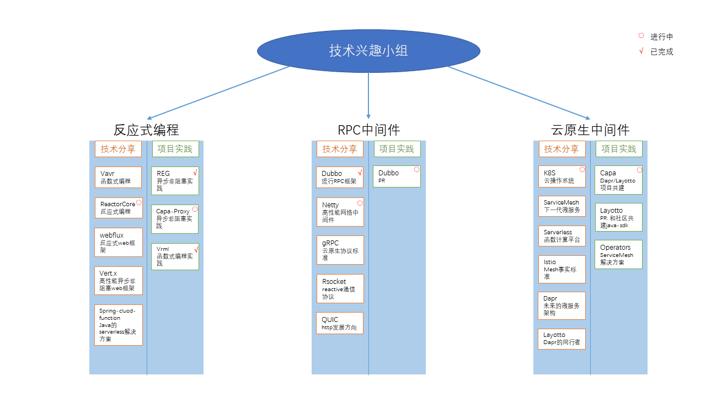
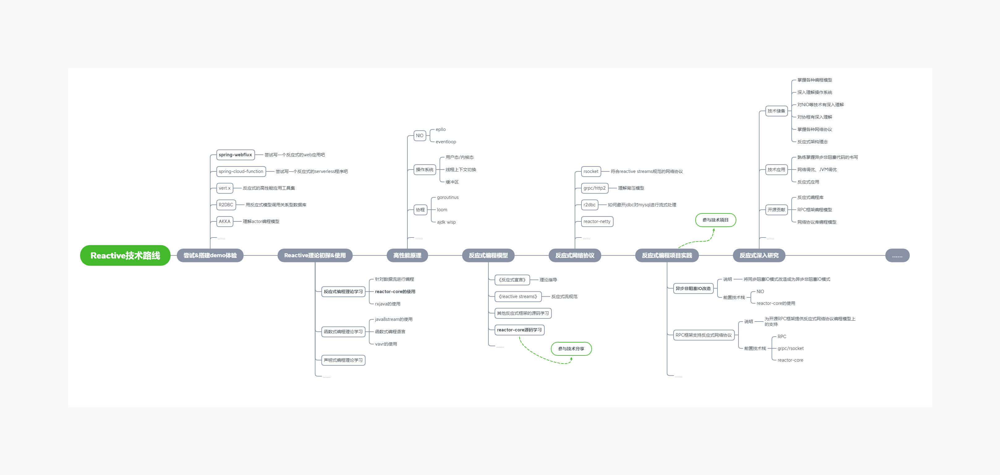

## SIG技术路线与小组划分

### 技术路线与SIG划分

共分为以下3个技术路线

------

### 反应式编程SIG

#### Why Learning Reactive?

随着移动设备和物联网、5G等技术趋势的兴起，未来网络并发的量级将会越来越高，而用户对网络延时的容忍却越来越低，新的挑战引发了新的思考。

面对传统BIO模式在IO密集型场景下的缺点，借助NIO和多路复用技术可解决上述BIO问题，目前Java项目对接NIO的方式主要依靠回调，代码复杂度高，降低了代码可读性与可维护性。随着Reactive反应式架构的流行，业界有一些公司开始推动服务的全异步升级，开始采用Reactive架构来解决此类问题。Reactive构建的程序代表的是异步非阻塞、函数式编程、事件驱动的思想。随着近年来Reactive编程模式的发展，能达到高性能与可读性的兼顾。

像Srping5推出的webflux，以及java在serverless领域的spring-cloud-function等，这些框架都采用了reactive的编程模型，以此来提供统一的异步非阻塞编程模式。以及在新兴的网络协议如rsocket、grpc领域，通过reactive编程模型来封装网络的背压实现。

所以学习reactive反应式编程，将有助于我们理解高IO场景下的解决方案，熟练使用webflux、scf、vertx等新兴的高性能框架，以及提升代码编写的优雅性。

#### Reactive技术路线目标

在提升个人技术素养方面：

1. 掌握应用底层高性能原理，夯实应用开发人员的根基。
2. 理解反应式编程相关理论，锻炼编程思维和架构思维。

在项目实践和开发方面：

1. 掌握异步非阻塞代码的coding，掌握高性能应用和系统的coding(例如webflux/vertx/scf/...)
2. 能够参与到社区中，高性能应用框架的开发当中，尤其是需要异步编程模式的框架(例如dubbo/reactor-netty/webflux/...)
3. 掌握反应式流的概念，对新兴网络协议有较深理解，能够参与到各种反应式网络协议相关的编程工作中(例如rsocket/grpc/...)

#### Reactive技术路线图

> 重点可以关注加粗的条目，其他项根据个人情况可进行选修。
> 
> 当达到"参与技术分享""参与技术项目"两个节点时，即有条件可以深入参加SIG相关内容的建设。

#### 相关资料

[Reactive SIG Material](./doc/Reactive/SIG_MATERIAL.md)

------

### RPC中间件SIG

#### Why Learning RPC?

随着微服务和云原生的推进，服务的粒度将会越来越细，而服务间的通信是必然要考虑的问题，网络一定是架构设计中的一等公民。

现在我们正处在网络技术变革非常迅速的时期，HTTP/1.1是初代的网络通信协议，其设计之初只针对人机交互而非服务间交互（其缺点不再赘述）。现在，HTTP/2与grpc，Rsocket、QUIC等协议蓬勃发展，带来了新的网络交互模式与新的RPC编程模型。

我们可以看到，dubbo3.0开始使用tripple协议，nacos2.0使用grpc进行交互，更不用提云原生组件之间使用grpc进行通讯已经是事实标准。

RPC中间件正处在关键的转型时期，轻SDK模式符合云原生的发展趋势，接入新的网络协议也是RPC要考虑的问题，以及该如何打通k8s和注册中心...一系列的问题和挑战也带来了新的机会，所以现在也是深入理解和参与RPC中间件的好时机。

#### RPC技术路线目标

在提升个人技术素养方面：

1. 掌握RPC中间件的原理，掌握分布式应用网络协议、通讯、治理等领域的技术。
2. RPC中间件作为核心的中间件，掌握涉及到的微服务、分布式等领域的相关技术。

在项目实践和开发方面：

1. RPC作为核心和常用的中间件，在任何项目的实践中都有广泛用途，掌握其原理和调优技术。
2. 能够参与到社区中RPC框架的开发当中，例如dubbo，作为中国最大的开源项目，参与到其中可以获得较大的技术影响力。
3. RPC作为前沿的技术领域，和云原生、网络协议等技术领域结合密切，可以建立全面的知识体系。

#### RPC技术路线图

> 重点可以关注加粗的条目，其他项根据个人情况可进行选修。
>
> 当达到"参与技术分享""参与技术项目"两个节点时，即有条件可以深入参加SIG相关内容的建设。

TODO

#### 相关资料

[RPC SIG Material](./doc/RPC/SIG_MATERIAL.md)

------

### 云原生中间件SIG

#### Why Learning CloudNative?

云原生是未来技术发展的一大趋势。

随着K8S、servicemesh、sererless等云原生架构的演进，未来新的架构将会逐渐取代现有的架构模式。

考虑到低代码平台的推进、云基础设施的完善、函数计算平台FAAS的推广，未来业务代码的门槛将会越来越低，只要简单的培训即可编写高性能的业务代码。再加上分布式服务运行时dapr等项目的演进，业务人员甚至不需要了解任何的中间件原理。

未来技术专家将会下沉到云基础设施和云组件中，首先技术专家们构建的组件会比大多数团队和个人自行构建的中间件更有优势，考虑到互联网的边际成本递减效应，一旦将该组件提供到云平台上，那么使用范围将会非常广泛，其成本也会越低，最终形成赢者通吃的现象。

所以作为有技术追求的应用开发人员，应当对云原生相关的架构有较深的了解，能够基于云原生的架构提供解决方案，最好能参与到某个领域的云组件开发当中。否则，在未来很容易只被局限在业务领域，失去真正的技术竞争力。

#### 云原生技术路线目标

在提升个人技术素养方面：

1. 掌握云原生的相关理念和思想，也就掌握了未来架构的设计模式。
2. 云原生是未来的技术发展趋势，其中很多技术思想具有建设性的意义，可以拓宽个人的技术眼界。

在项目实践和开发方面：

1. 理解了云原生的架构和各种核心的云组件，在技术选型上将具有新的思考和选择。
2. 无论是RPC还是其他中间件，目前都在往云原生的方向靠拢，掌握云原生可以参与到这些中间件的云原生改造当中(例如dubbo3.0)。
3. 了解最前沿的技术动态，把握技术红利，参与到最前沿的技术当中，一是有更多的参与机会，二是可以构建个人的技术影响力。

#### 云原生技术路线图

TODO

#### 相关资料

[CloudNative SIG Material](./doc/CloudNative/SIG_MATERIAL.md)